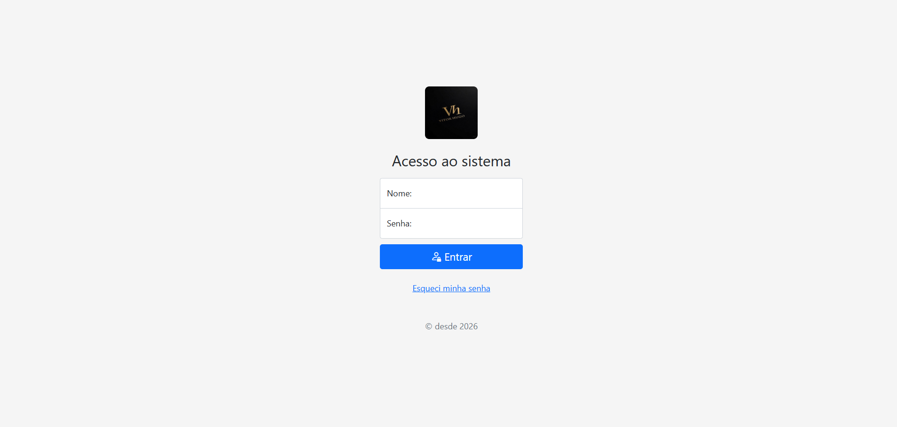
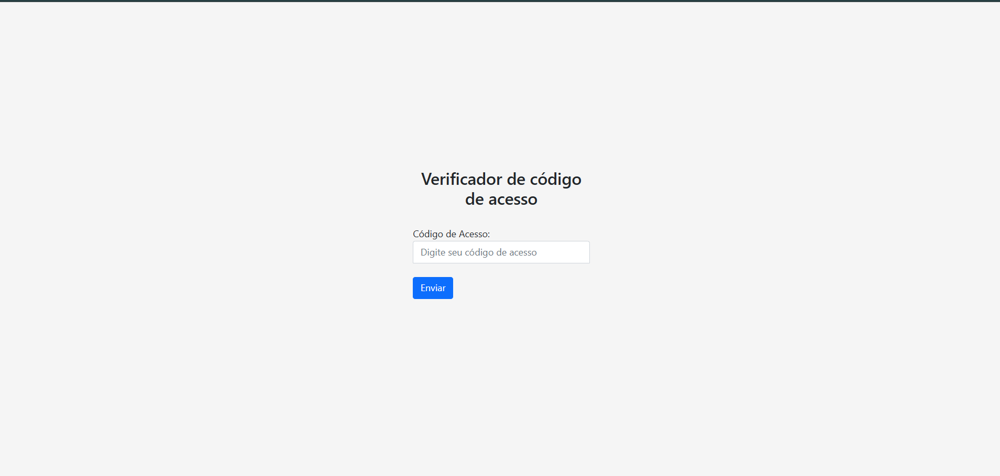
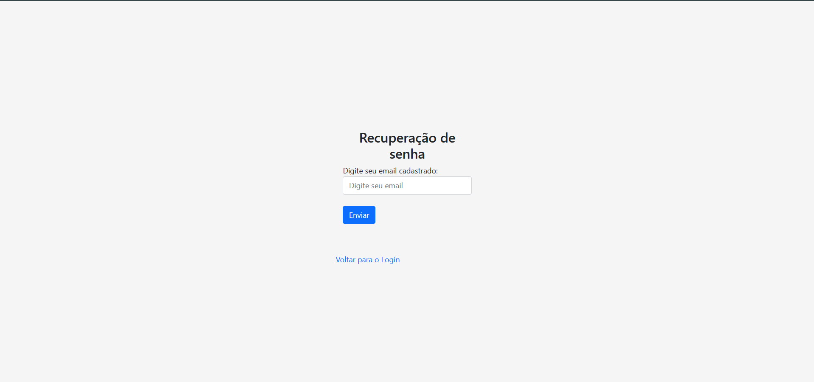
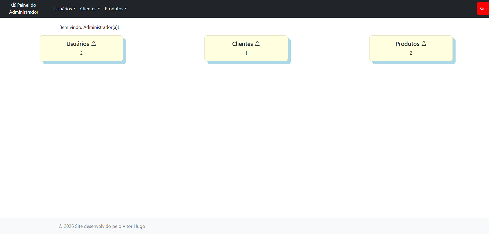
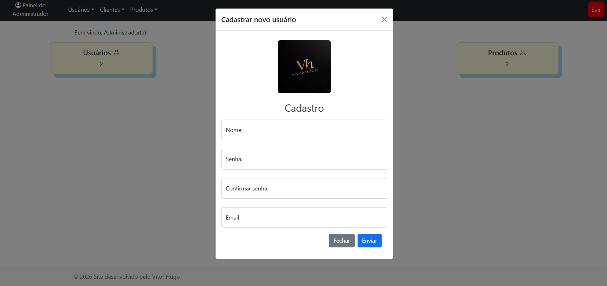
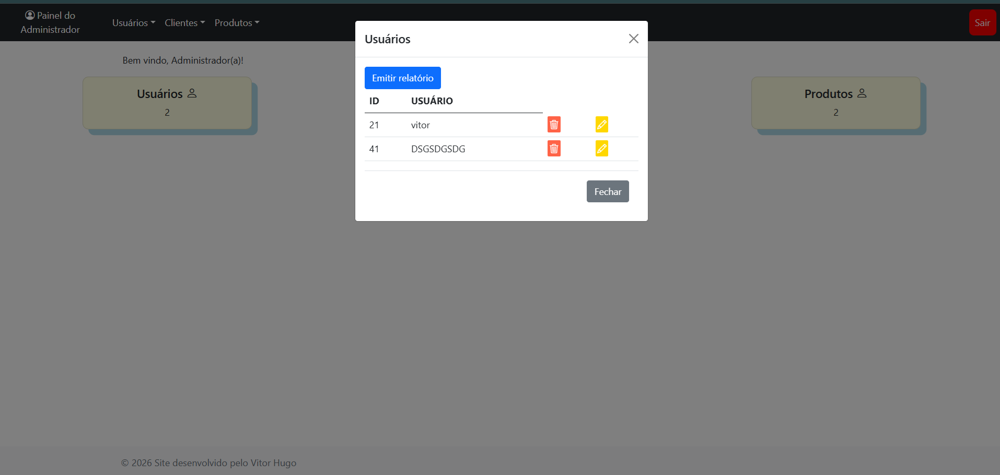
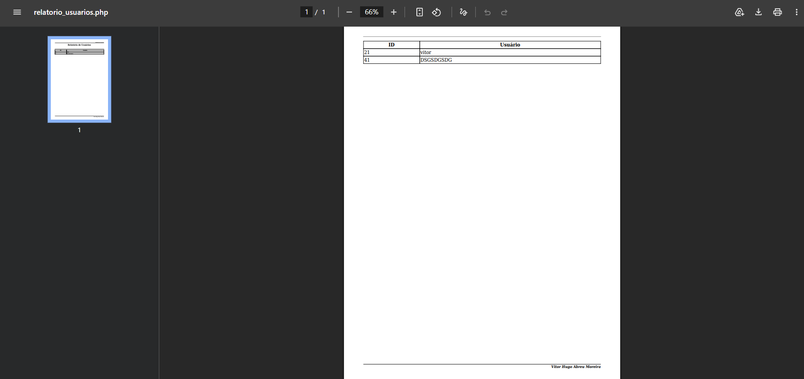
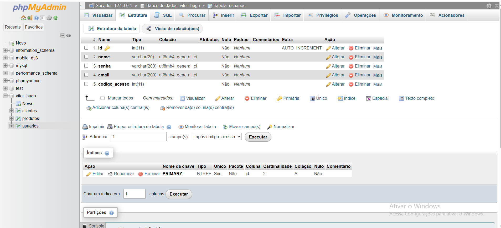
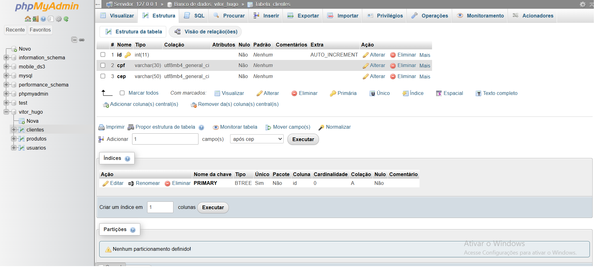
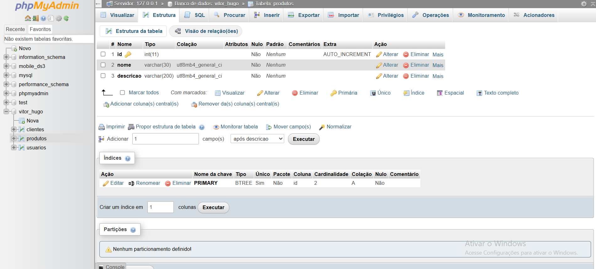

# 📊 Painel Administrativo

Sistema web de painel administrativo com autenticação de usuários e gerenciamento completo (CRUD) de **usuários, clientes e produtos**, além da geração de relatórios em PDF.














---

## 🚀 Funcionalidades

- 🔐 **Login de usuários**
  - Autenticação com validação (`valida_login.php`)
  - Recuperação de senha (`recuperacao.php`, `esqueceuSenha.php`)

- 📊 **Dashboard**
  - Página principal (`dashboard.php`)
  - Acesso às funcionalidades do sistema

- 👥 **CRUD de Usuários**
  - Cadastro (`cadastroUsuarios.php`)
  - Edição (`editaUsu.php`)
  - Exclusão (`delUsu.php`)

- 🧑‍💼 **CRUD de Clientes**
  - Cadastro (`cadastroClientes.php`)
  - Edição (`editaCliente.php`)
  - Exclusão (`delCliente.php`)

- 📦 **CRUD de Produtos**
  - Cadastro (`cadastroProdutos.php`)
  - Edição (`editaProduto.php`)
  - Exclusão (`delProduto.php`)

- 📄 **Relatórios em PDF**
  - Usuários (`relatorio_usuarios.php`)
  - Clientes (`relatorio_clientes.php`)
  - Produtos (`relatorio_produtos.php`)
  - Utilizando `mpdf`

- 📧 **Envio de Email**
  - Implementado com `PHPMailer`

---

## 🛠️ Tecnologias Utilizadas

- **Backend:**
  - PHP

- **Frontend:**
  - HTML
  - CSS
  - JavaScript
  - Bootstrap

- **Banco de Dados:**
  - MySQL

- **Servidor:**
  - XAMPP

- **Bibliotecas:**
  - PHPMailer
  - mPDF

---

## 📂 Estrutura do Projeto
```
/painel_dashboard
│── /estilo # Arquivos CSS
│── /imagens # Imagens do sistema
│── /php_mailer # Biblioteca de envio de emails
│── /vendor # Dependências (Composer)
│── conexao.php # Conexão com banco de dados
│── login.php # Tela de login
│── valida_login.php # Validação de login
│── dashboard.php # Painel principal
│
│── cadastroUsuarios.php
│── editaUsu.php
│── delUsu.php
│
│── cadastroClientes.php
│── editaCliente.php
│── delCliente.php
│
│── cadastroProdutos.php
│── editaProduto.php
│── delProduto.php
│
│── relatorio_usuarios.php
│── relatorio_clientes.php
│── relatorio_produtos.php
│
│── recuperacao.php
│── esqueceuSenha.php
│── codigo_email.php
```
---

## ⚙️ Como Executar o Projeto

```bash

1. Clone o repositório:

git clone https://github.com/seu-usuario/seu-repositorio.git

2. Mova o projeto para a pasta do XAMPP:

C:\xampp\htdocs\

3. Inicie o XAMPP:
- Apache ✅
- MySQL ✅

4. Configure o banco de dados:

- Acesse: http://localhost/phpmyadmin
- Crie um banco (ex: painel_dashboard)
- Crie as tabelas com os devidos campos e adicione um nome e email valido
- Depois de ter feito as tabelas e ter inserido em usuários o seu nome e email,
clique em esqueci senha no login.php e coloque o email do banco na página seguinte,
no seu email chegará uma senha para você poder acessar o sistema.

5 . Configure a conexão:
$host = "localhost";
$user = "root";
$pass = "";  <-- Coloque a senha caso você tenha no seu XAMPP
$db = "painel_dashboard";

```
## Estrutura das tabelas no banco de dados




---

🔒 Requisitos

- PHP 7 ou superior
- XAMPP
- Composer (para dependências)

---

📌 Melhorias Futuras

- Responsividade completa
- Dashboard com gráficos

---

📄 Licença

Este projeto é destinado para fins acadêmicos e de aprendizado.


---

Desenvolvido pelo Vitor Hugo
